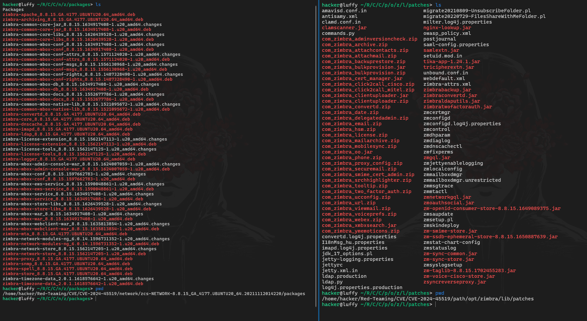

# CVE-2024-45519 Breakdown and Root Cause Analysis (Under the Supervision of Swati Laxmi)

### Overview of Zimbra Collaboration Suite
Zimbra Collaboration Suite (ZCS) is a widely-used open-source platform that provides email and collaboration services, including calendaring, contacts, tasks, and chat. Renowned for its flexibility and open-source nature, Zimbra is often chosen by organizations as an alternative to proprietary solutions, particularly in educational institutions, government agencies, and enterprises. Given its broad adoption, Zimbra is a critical target for attackers. Vulnerabilities in this platform can have far-reaching effects, making security crucial. Through extensive research, I have gained a thorough understanding of the root cause of the vulnerability in the package.

### The Importance of Remote Command Execution Vulnerabilities
Remote Command Execution (RCE) vulnerabilities are among the most dangerous as they allow attackers to execute arbitrary commands on a target server. This type of vulnerability grants attackers direct access to the underlying system, which can lead to serious security breaches, including data compromise, privilege escalation, and lateral movement within a network. For collaborative platforms like Zimbra, RCE vulnerabilities are especially impactful, as they can expose an organization's communication infrastructure and lead to significant data breaches and operational disruptions. Imagine an attacker gaining control of your server’s shell, running arbitrary commands at will.

### Overview of CVE-2024-45519
CVE-2024-45519 is a recently discovered RCE vulnerability that affects specific versions of Zimbra Collaboration Suite. The vulnerability stems from insufficient input validation within Zimbra’s web application, allowing attackers to craft malicious requests that execute arbitrary commands on the server. Discovered in October 2024, CVE-2024-45519 has a high CVSS score of 9.4, which reflects its severe impact and ease of exploitation. Organizations using the affected versions of Zimbra are strongly urged to apply security patches promptly to mitigate the risks associated with this vulnerability.

# Vulnerability Analysis

### How CVE-2024-45519 Occurs
The vulnerability in CVE-2024-45519 arises from weak input validation within Zimbra’s web application. Certain fields in Zimbra's HTTP requests are not properly sanitized, allowing attackers to inject and execute malicious commands on the server. This insufficient input validation leads to a command injection vulnerability, where the attacker bypasses standard security checks and runs arbitrary commands. Upon deeper investigation, I discovered that the vulnerability is tied to the `postjournal` service, where I identified key differences in the paths that expose the vulnerability.

### Why This Vulnerability is Exploitable
CVE-2024-45519 is exploitable because of Zimbra's relaxed input validation. Due to improper sanitization, certain fields in HTTP requests are vulnerable to command injection. Attackers can craft specially designed HTTP requests containing malicious payloads that the backend processes as legitimate commands, executing them with the privileges granted to the Zimbra service account. This lack of strict input handling makes it easy for attackers to manipulate the system.

### Impact of Exploitation
Exploitation of CVE-2024-45519 provides attackers with the ability to run arbitrary commands on the Zimbra server. This access can lead to several severe consequences:

- **Privilege Escalation**: Attackers can leverage this vulnerability to escalate their privileges, potentially gaining access to other sensitive areas of the server or network.
- **Data Compromise**: Attackers can read, modify, or delete emails, contacts, and other sensitive information stored within Zimbra.
- **Further Network Compromise**: Once inside Zimbra, attackers may pivot to other parts of the network, executing additional attacks and establishing persistence.

In conclusion, CVE-2024-45519 represents a serious risk to Zimbra deployments. It underscores the need for robust input validation and timely patching to prevent unauthorized access and data breaches.
