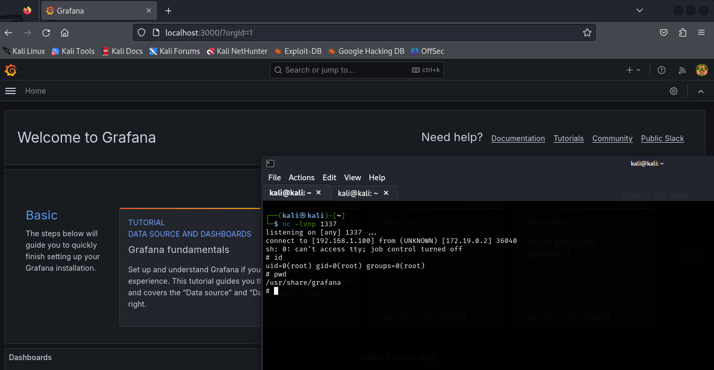

# Grafana SQL Expressions Vulnerability Allows Remote Code Execution



**CVE ID**: CVE-2024-9264  
**Date Published**: October 17, 2024  

## Description

The **SQL Expressions** experimental feature of **Grafana** allows for the evaluation of **DuckDB** queries that can contain user input. However, these queries are **insufficiently sanitized** before being passed to DuckDB, resulting in a **command injection** and **local file inclusion (LFI)** vulnerability.

This vulnerability allows an attacker to execute arbitrary commands on the system and potentially read sensitive files, which can be exploited by any user with **VIEWER** or higher permissions in Grafana.

The attack requires the **DuckDB binary** to be present in Grafana's **$PATH**, but by default, this binary is **not included** in Grafana distributions. If the binary is installed, however, the vulnerability can be exploited.

The vulnerability was introduced in **Grafana version 11.0.0** and has been fixed in the following versions (for both OSS and Enterprise editions):

- **11.0.5+security-01**
- **11.1.6+security-01**
- **11.2.1+security-01**
- **11.0.6+security-01**
- **11.1.7+security-01**
- **11.2.2+security-01**

**Note**: The fixes have been provided for both the latest and previous patch versions of all impacted releases. This ensures that users who are still in the process of updating can mitigate the vulnerability immediately without requiring further changes.

---

## Set Up Your Own Lab

DuckDB is an open-source project, and the vulnerable build is available in their GitHub assets. Since it's open-source, there is nothing hidden, and you can manually download it. However, to simplify the process, you can use the Dockerfile provided in the repository.

1. Visit [DuckDB releases](https://github.com/duckdb/duckdb/releases) and download version **0.8.1** (the version used for this demonstration).
2. Run the Dockerfile from the repository.
3. Once the container is up and running, access Grafana at [http://localhost:3000](http://localhost:3000).

---

## Attack Scenario

To exploit this vulnerability and achieve remote code execution, follow these steps:

### 1. Set up a Netcat listener

Start a Netcat listener on an unused port on your machine to catch the reverse shell:

```bash
nc -lvp <port>
```

Replace <port> with any open, unused port on your machine.
### 2. Run the POC file

Run the Proof of Concept (POC) file in Grafana that triggers the vulnerability. The POC will inject malicious code into the SQL expressions, causing the remote code execution.
### 3. Gain Access

Once the attack is executed, you should have access to the system through the reverse shell opened by the Netcat listener.

