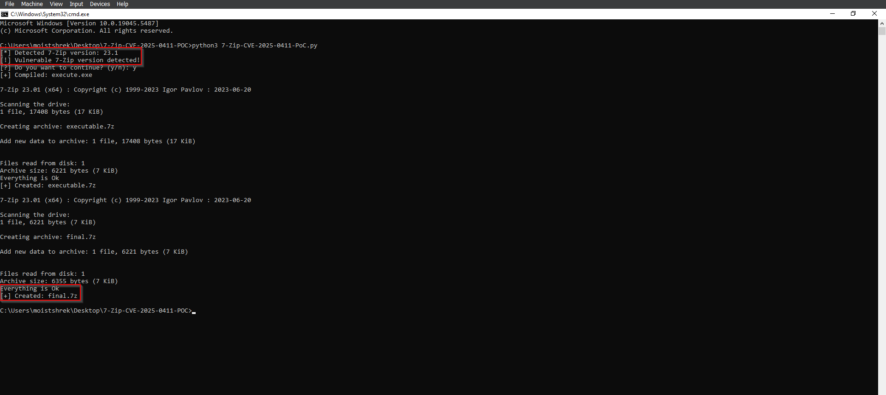
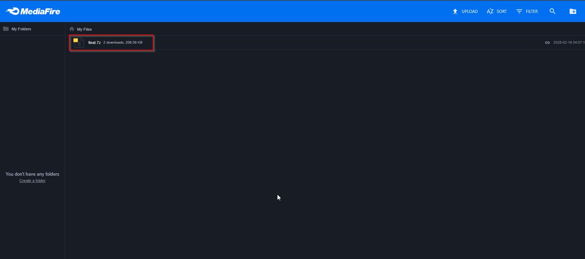
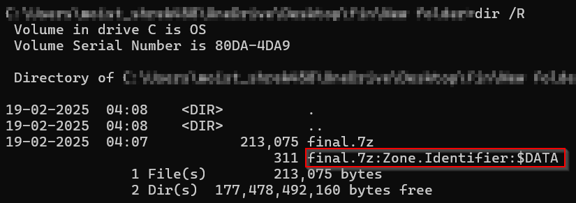
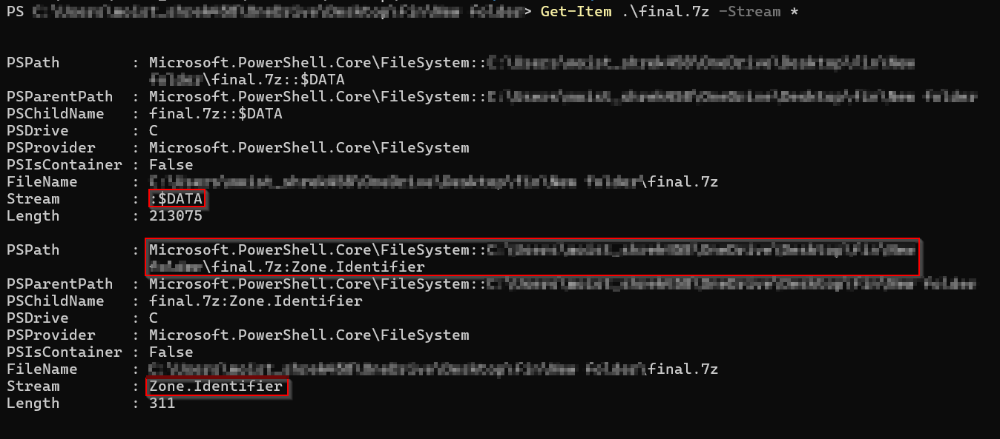
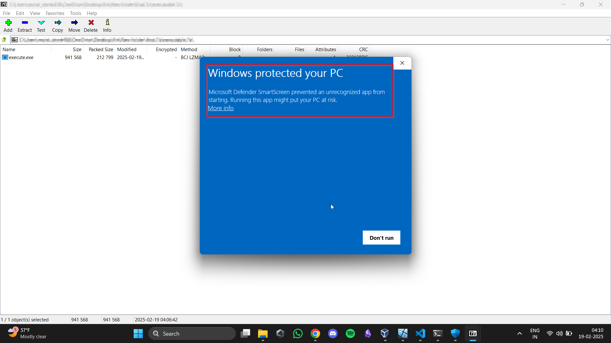
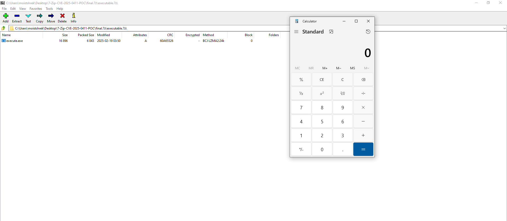

# 7-Zip Allows MoTW Bypass in Nested Zip Files

## PoC
##### **Note**, this PoC is desgined to demonstrate the MoTW bypass and hence would be needed to follow along by turning _**off**_ the **Windows Defender**. The intention is to demonstrate the bypass, if needed to use in the real world red teaming scenarios, the Python Script can be used for version detection and double compression purposes.
### Introduction
[CVE-2025-0411](https://nvd.nist.gov/vuln/detail/CVE-2025-0411) is a recently discovered vulnerability in the popular 7-Zip file archiver software that allows attackers to bypass Windows’ Mark-of-the-Web (MoTW) protection mechanism. This bypass enables malicious files extracted from specially crafted archives to execute without triggering security warnings, exposing users to potential threats such as malware and phishing attacks. The PoC to be demonstrated builds up on it, it covers how an attacker can craft a nested archive to evade MoTW protections.

#### Understanding the Files 

##### 7-Zip-CVE-2025-0411-PoC.py (Python Script) 
This script automates the process of checking the version of the installed 7Zip version, compilation and compression of a C++ executable: 

* **Version Checking** checks if 7Zip is installed on the target system or not and then also version checks it to see if the installed version is vulnerable or not. 

* **Compiles** a C++ source file (executable.cpp) into a statically linked Windows executable (execute.exe) using g++. 

* **Compresses** the generated executable into a .7z archive using 7-Zip. 

* **Further compresses** the first archive (executable.7z) into a final .7z archive (final.7z). 

The script ensures the process runs sequentially, checking for file and software existence before proceeding. 

##### Executable.cpp (C++ Shellcode Loader) 

This C++ program executes shellcode in memory: 

* **Allocates** memory (VirtualAlloc) with read-write permissions. 

* **Copies shellcode** for running calc.exe into the allocated memory. 

* **Changes memory protection** to executable (VirtualProtect). 

* **Creates a new thread** (CreateThread) to execute the shellcode. 

* **Waits** for execution to complete. 

#### Preparation of the Nested .7z and obtaining the MoTW 
After cloning the repository, we need to run the script via any terminal in order to detect the version of the software used and to compress our shellcode file.

After double compressing the file, we have successfully gotten a nested file. But, if we try to access the file from the 7Zip GUI(accessing it through 7Zip in general), it would not result into our desired response because our file is still missing it's key component, the MoTW.  

To solve this issue, we can upload the file _final.7z_ to any platform like MediaFire, Google Drive, Mega etc. This is used in order to simulate the delivery of our .7z file,  

After we download our file, it now bears the MoTW. We can confirm it via running the following commands, 

    > dir /R (Can be used in either CMD or PowerShell)
    

    > Get-Item .\final.7z -Stream * (To be used in PowerShell)
 

In the aforementioned we observe the file having an Alternate Data Stream rather than the original ::$DATA which has the file data, the second stream containing the Zone.Identifier stream confirms the MoTW. 

#### Execution 

In versions where the vulnerability is patched we see that when we access the compiled executable via the 7-Zip software we see a SmartScreen alert blocking the execution of our shellcode. This is because of the correct migration of the MoTW from each nested file, mitigating the issue. 

Whereas, in an ideal situation where we have 7-Zip installed and our version is vulnerable(prior to 24.09) we can now access the file via opening it via 7-Zip and we can see how our shellcode can execute successfully. 

