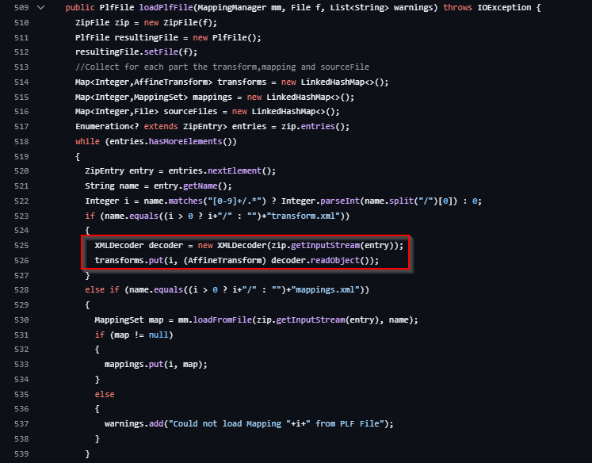
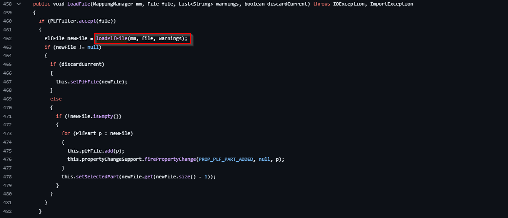
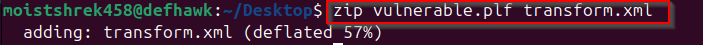

<<<<<<< HEAD
# Reproduction of Recent CVEs

This repository is based on recently discovered CVEs and focuses on how to exploit, patch, and investigate the root causes of these vulnerabilities. DefHawk is working on high-critical CVEs that have caused significant damage to services, aiming to explore the extent of the impact.

Each section in this repository is dedicated to a specific vulnerability and contains all the information needed to set up a safe environment. Some sections also include instructions on exploiting the vulnerability in real-world scenarios. After thorough research, a detailed report will be attached to each section.

For a list of CVEs covered, see the following document:
[Google Sheets List of CVEs](https://docs.google.com/spreadsheets/d/1M6E_NRWxdLzWCeyMM0Dgepo36WiLItvFS30I3dHeWO0/)


# CVE-XXXX-XXXX


| **Step**                           | **Details**                                                                                                          | **Progress**      | 
|------------------------------------|----------------------------------------------------------------------------------------------------------------------|-------------------|
| **Set up a Safe Testing Env**      |                                                                                                                      |   :heavy_check_mark:          |
| - Create a Virtual Lab             | Use VirtualBox, VMware, or Docker to create an isolated environment.                                                 |   :heavy_check_mark:
|   - Choose a Suitable OS           | Install an OS compatible with the CVEs (e.g., Linux, Windows, or a specific version of software).                   | According to the CVE :heavy_check_mark:
|     - Install Necessary Tools      | Include tools like Metasploit, Burp Suite, or specific debugging tools relevant to the CVEs.                        |    :heavy_check_mark:
| **Select Recent CVEs to Reproduce**|                                                                                                                      |
| - Severity and Exploitability      | Focus on CVEs with high CVSS scores and known exploitation in the wild.                                             |    :heavy_check_mark:
|   - Availability of Public PoCs    | Choose vulnerabilities with available PoCs for easier reproduction.                                                  |   :heavy_check_mark:
|     - Compatibility with My Env    | Ensure the CVE is compatible with your virtual lab setup (OS and software versions).                                |    ❎
| **Download and Set up the PoCs**   |                                                                                                                      |
| - Find the PoCs in Test Env        | Search on GitHub or Exploit-DB for reliable PoCs related to selected CVEs.                                           |  :heavy_check_mark:
|   - Verify PoC and Audit           | Carefully read and test the PoC in a controlled environment; audit output to ensure it matches expected behavior.   |   :heavy_check_mark:
| **Simulate and Document Process**  |                                                                                                                      |
| - Prepare Documentation            | Document each setup step, including OS, software versions, and configurations.                                       |  ⏲️
|   - Execute the Exploit            | Run the PoC and capture screenshots or logs to verify successful exploitation.                                       |  ⏲️
|     - Analyze the Results          | Explain how the vulnerability was exploited and why it works, with screenshots or logs as evidence.                |
| **Present the Findings**           |                                                                                                                      |
| - Overview of the CVEs             | Provide a brief summary, CVSS score, and affected software for each CVE.                                             |  
|   - Reproduction Steps             | Include clear instructions for setting up and reproducing each CVE in a controlled environment.                      |
|     - Screenshots and Evidence     | Add screenshots or logs showing successful exploitation.                                                            |
|       - Mitigation                 | List any patches, configuration changes, or mitigations for each vulnerability.                                     |
| **Additional Tips**                |                                                                                                                      |
| - Security Practice and Approach   | Follow safe security practices and take a controlled "hacker" approach to prevent risks.                            |


## 📌 CVEs Included

| CVE ID              | Description |
|---------------------|------------|
| **CVE-2020-7660**  | **`serialize-javascript` Remote Code Execution**: A vulnerability in `serialize-javascript` allows attackers to execute arbitrary code during the deserialization process. |
| **CVE-2024-31982** | **XWiki Remote Code Execution (RCE)**: An RCE vulnerability in XWiki enables attackers to execute arbitrary code remotely, compromising the affected system. |
| **CVE-2024-45519** | **Zimbra Remote Command Execution (RCE)**: A vulnerability in Zimbra allows remote attackers to execute arbitrary commands on the server, potentially leading to full system compromise. |
| **CVE-2024-46538** | **pfSense Cross-Site Scripting (XSS)**: A cross-site scripting vulnerability in pfSense v2.5.2 allows attackers to inject arbitrary web scripts or HTML via a crafted payload, potentially leading to unauthorized access or data leakage. |
| **CVE-2024-49113** | **Grafana Command Injection and Local File Inclusion**: An issue in Grafana's SQL Expressions feature allows attackers to execute arbitrary commands and include local files, potentially leading to remote code execution and unauthorized file access. |
| **CVE-2024-9264**  | **Grafana Command Injection and Local File Inclusion**: Another critical vulnerability in Grafana's SQL Expressions feature enables command injection and local file inclusion, posing significant security risks. |
| **CVE-2025-0411**  | **7-Zip Mark-of-the-Web Bypass**: A vulnerability in 7-Zip allows attackers to bypass the Mark-of-the-Web protection mechanism, potentially executing malicious code without user consent. |
| **CVE-2025-26794** | **Exim Remote SQL Injection**: A vulnerability in Exim versions prior to 4.98.1 allows remote attackers to perform SQL injection attacks, potentially compromising the mail server. |
| **CVE-2025-1094** | **Postgre SQL Injection**: Improper neutralization of quoting syntax in PostgreSQL libpq functions PQescapeLiteral(), PQescapeIdentifier(), PQescapeString(), and PQescapeStringConn() allows a database input provider to achieve SQL injection in certain usage patterns. |
| **CVE-2024-13918** | **Laravel Reflected XSS**: Improper handling of user-supplied input in Laravel's debug-mode error page allows an attacker to inject arbitrary HTML/JavaScript code into the response. When `APP_DEBUG=true`, an attacker can craft a URL with a malicious query string that triggers a 500 error and reflects the payload in the error page, leading to Reflected Cross-Site Scripting (XSS). |


## 🚀 How to Use
1. Clone the repository:
   ```bash
   git clone https://github.com/defhawk-specter/defhawk-cve.git
    ```

2. Navigate to the CVE folder of interest
.
3. Follow the instructions in the respective CVE directory.

## Disclaimer

This repository is strictly for educational and research purposes. Any misuse of this information is strictly prohibited. Use at your own risk!
=======
# Introduction to VisiCut

VisiCut is an open-source software designed to streamline the preparation and transmission of designs to laser cutters. It offers a user-friendly interface for importing design files, tweaking cutting parameters, and managing compatible laser cutter hardware. Supporting a variety of laser cutter models, VisiCut is a versatile tool for hobbyists, makers, and professionals in prototyping, manufacturing, and design. It is available on Linux, macOS, and Windows, with particular popularity among Linux users via a `.deb` package. Hosted on GitHub, its open-source nature ensures regular updates and wide accessibility.

# Understanding the CVE-2025-25940

CVE-2025-25940 is a critical vulnerability in VisiCut 2.1, identified in January 2025. It stems from insecure XML deserialization within the `loadPlfFile` method in `VisicutModel.java`. The software unsafely uses `java.beans.XMLDecoder` to process XML input from `.plf` files. Loading a malicious `.plf` file with a harmful `transform.xml` can trigger arbitrary code execution, potentially granting attackers remote access to a user’s system. This flaw’s severity lies in its exploitation simplicity—tricking a user into opening a file—posing risks like system compromise or laser cutter damage.

# PLF Archives

`.plf` files, or **VisiCut Portable Laser Format** files, are zip archives that bundle design data, configurations, and transformations for laser cutting tasks. They typically contain:

- **Design Files**: Vector or raster files (e.g., SVG, DXF) defining cutting patterns.
- **Transformations**: Instructions in `transform.xml` for positioning or scaling designs.
- **Mappings**: Settings in `mapping.xml` linking designs to laser parameters (e.g., power, speed).
- **Metadata**: Project details like file paths or indices.

# Root Cause of the Vulnerability

The vulnerability originates from inadequate sanitization of `.plf` files. In `VisicutModel.java`, the `loadPlfFile` method deserializes `transform.xml` using `XMLDecoder` without validation. 

This lack of checks extends to the `loadFile` function, invoked via the GUI’s "Open" feature, allowing malicious XML to execute arbitrary code upon loading.


# Proof of Concept

To summarize, **CVE-2025-25940** is prized for its **remote code execution** potential and **hardware control implications**. Below is a Proof of Concept (PoC) with detailed exploitation steps for CVE-2025-25940, a critical vulnerability in VisiCut 2.1. The vulnerability stems from insecure XML deserialization in the **loadPlfFile** method of **VisicutModel.java**, allowing an attacker to execute arbitrary code by crafting a malicious .plf file. When loaded into VisiCut, this file can trigger remote code execution (RCE), potentially compromising the victim's system or connected hardware like laser cutters.Exploitation steps include:

### Crafting a Malicious `.plf` File:
Build a `.plf` zip with a malicious `transform.xml` exploiting `XMLDecoder` for running commands on the given system.
   - **On Linux**:  
     zip malicious.plf transform.xml
     
     
   - **On Windows**:  
     Zip as `.zip`, then rename to `.plf`.

### Delivery Mechanism:
In real life scenarios we can use social engineering (e.g., phishing with **"FinalWorkBenchDesign.plf"**) to lure users into opening the file via VisiCut’s GUI.
<br>
Here, we open the file with the VisiCut Software, either through the drop-down or open-with the software.

### Exploitation:
- Upon opening, `loadPlfFile` executes the payload. In the given scenario, a file **"visicut.txt"** gets created under **"/tmp"** 

<br>


### Mitigation Strategies

- **Patch and Update**  
  - **Action:** Upgrade to a patched version of **VisiCut** once available, monitoring the GitHub repository for fixes.  

- **Replace XMLDecoder**  
  - **Action:** Eliminate the use of **XMLDecoder** for untrusted input, opting for safer deserialization formats like **JSON** that don’t allow arbitrary code execution.  

- **Validate Input**  
  - **Action:** Add strict validation to ensure **transform.xml** conforms to an expected structure, rejecting malformed or malicious content. We can use **whitelisting** or **schema validation** to block payloads.  

- **User Awareness**  
  - **Action:** Educate users not to open **.plf** files from untrusted sources, or if necessary, thoroughly inspect the file contents before running.  
>>>>>>> cc6f055 (Adding files for the VisiCut Demo)
